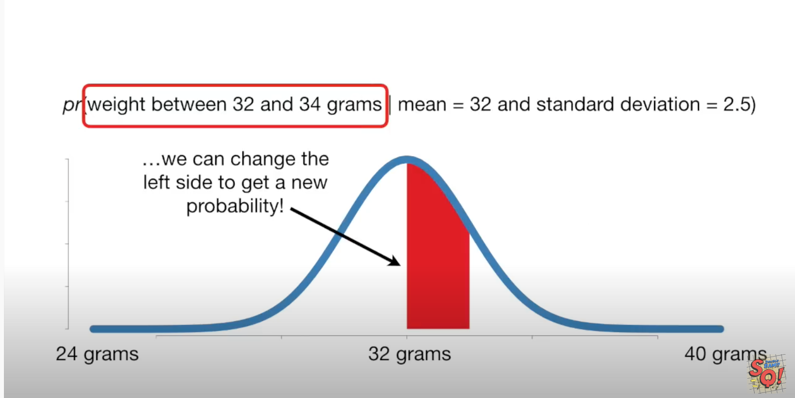
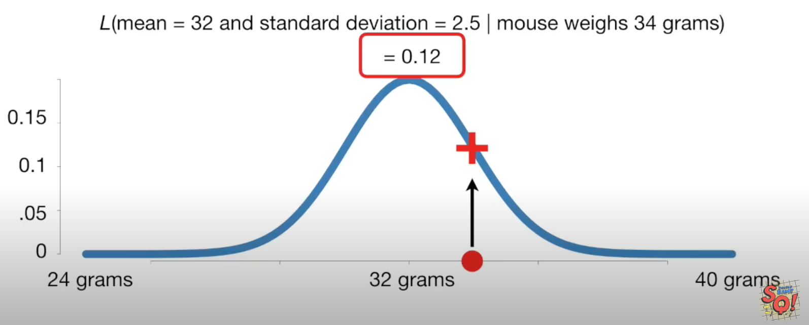

## Probability 

1. Area under the distribution . 
    pr(data | distribution )
    
    pr(mouse weigh > 34 gms | mean = 32 and SD = 2.5) 
    

## Likehood

1. Point in Y axis given the data 
    L ( distribution | data ) 
    L( Mean = 34 , SD = 2.5 | mouse weight 34 gms ) = 0.21 
    L( Mean = 32 , SD = 2.5 | mouse weight 34 gms ) = 0.12 
    
    