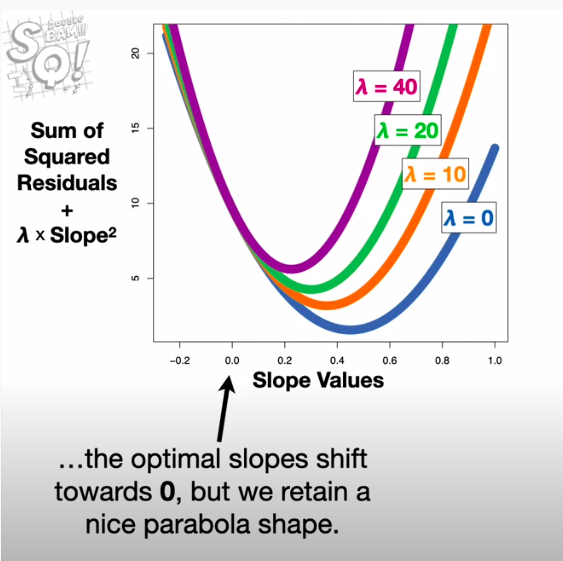
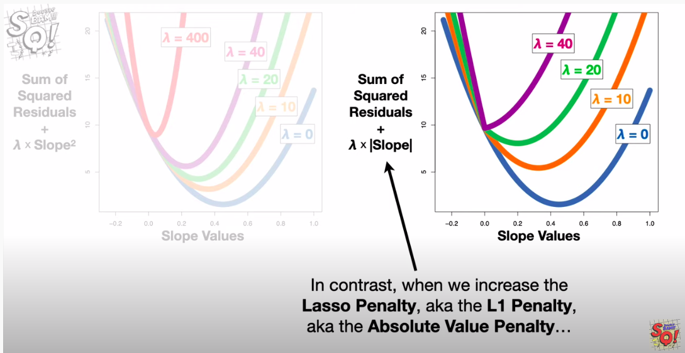

## Linear Regression -

1. How Gradient desent parabola arrived ?

    Map Residual Square ( Loss function value ) to Slope.

    when the slope increases , error reduces and this when plotted gives parabola
    So our aim is to reach the minima of parabola and slope value of that would be the least value for loss function


## Ridge Regression - Slope square Penality - L2 Regularization

1. Used when you want to penalize the higher slope and to avoid overfitting during linear regression ( Least Square method )
2. How to Penalize .
    Least square cost function - (y-y^)
    Ridge -
    ``` math
     (y-y^)2 / lambda + slope2

3. Used when number of data is less than features . Happens in genes research.
   Linear Regression expects atleast same number of data rows as features inorder to identity best fit line or hyperplane

    Ridge regression penality of slope can used since this can identify the best line without above expectation

4.


## Lasso Regression - Absolute value Penality - L1 Regularization

1. Lasso is same as Ridge expect that the slope value can go to zero .
2. Advantage in this is you can use this it automatically removes features which are not co-related to dependent variable
   How ? - Value of slope is zero and the relation to dependent is ignored


### Comparison Ridge vs Lasso






### Logistic Regression

1.  Assumption - Values on the left side of slope. + ve 
                 Values on the right side of slope =ve 
                 
```Math
y X wT+c
```


